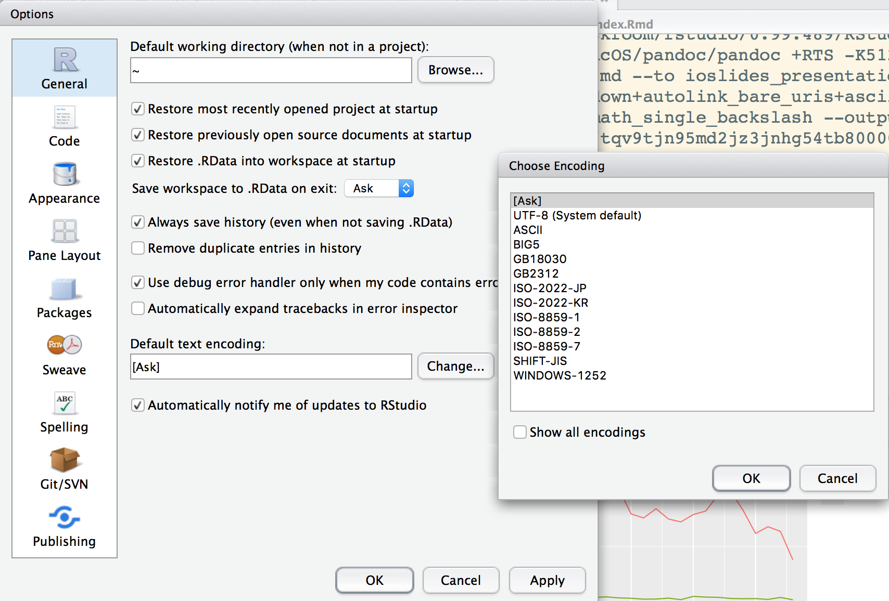
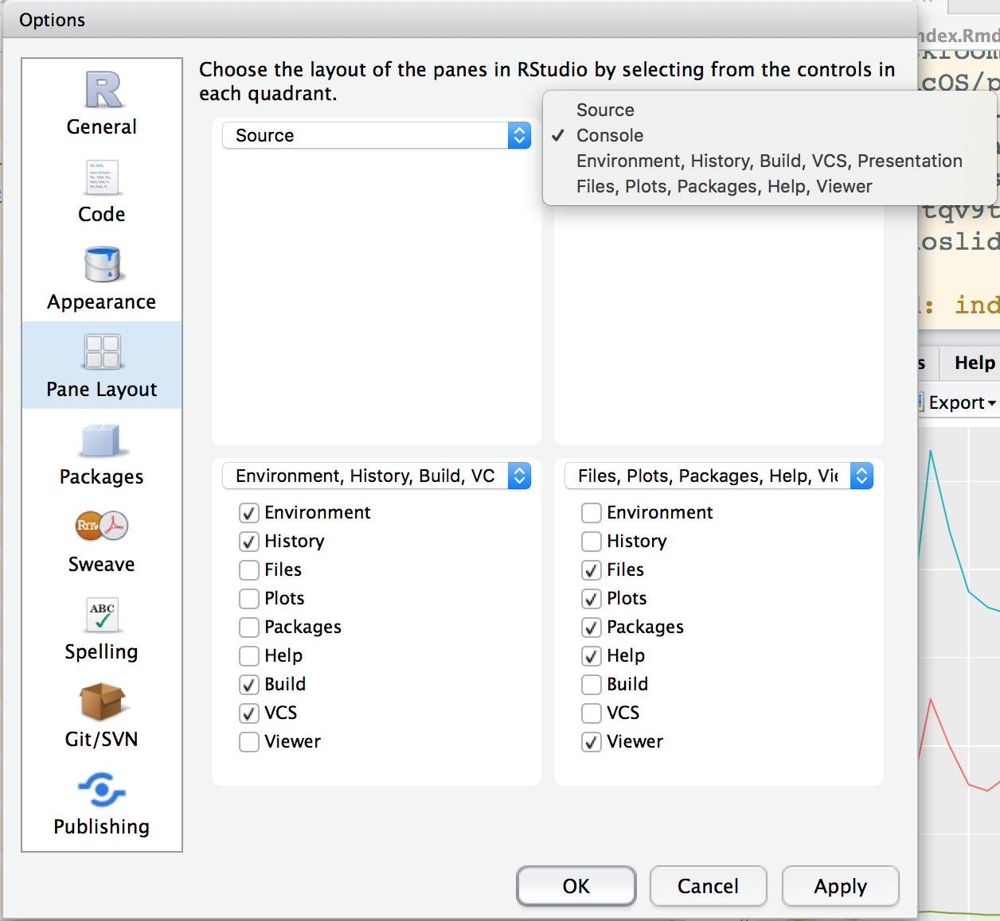
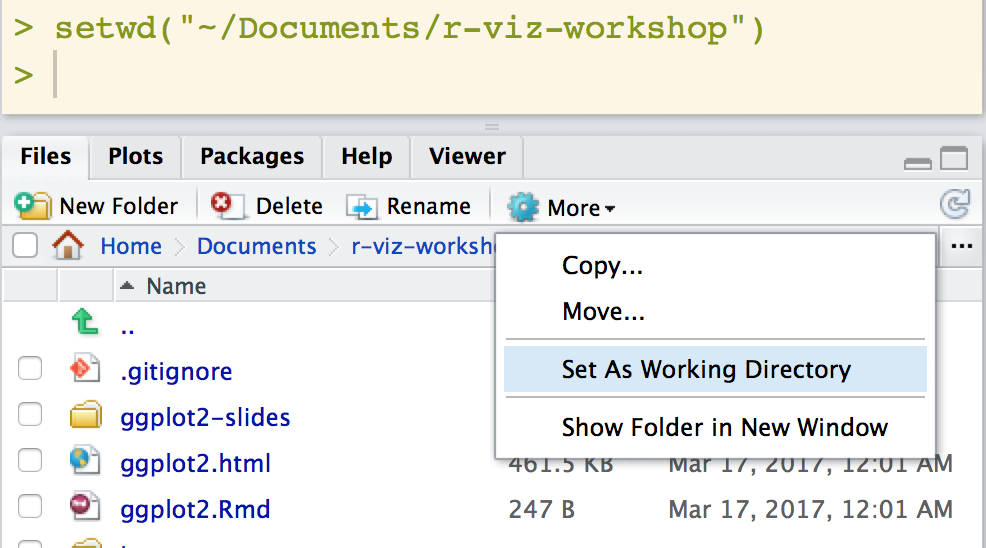
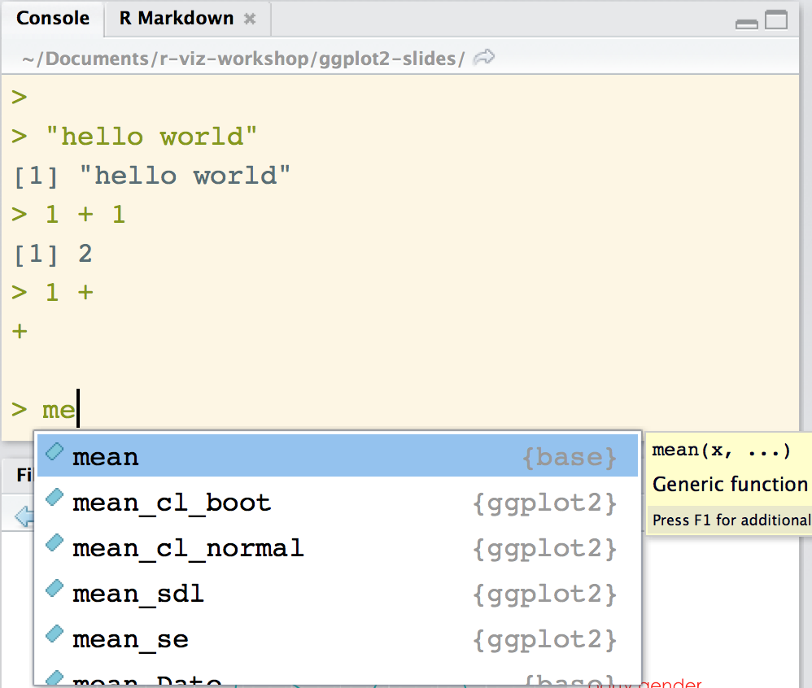
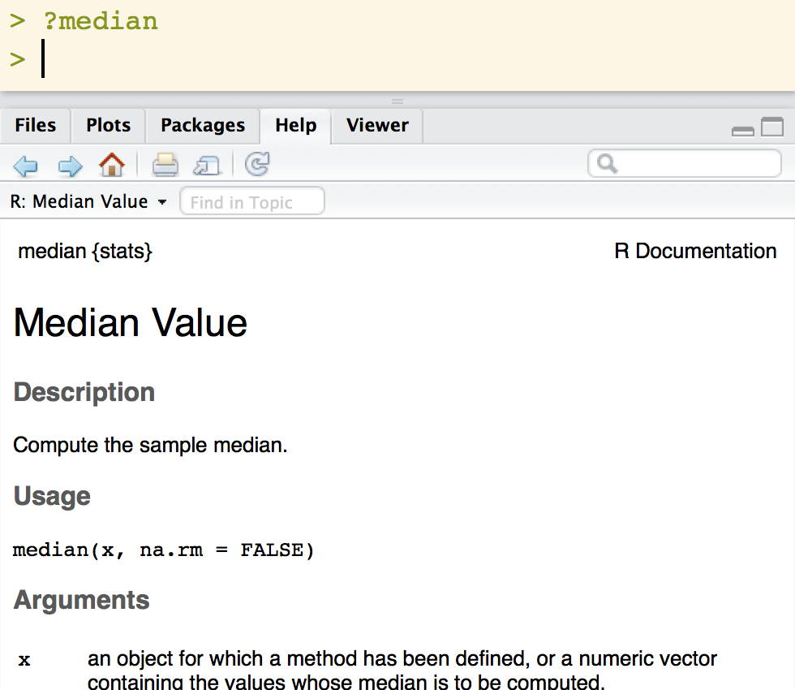
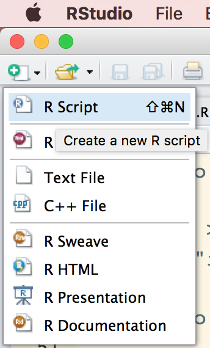
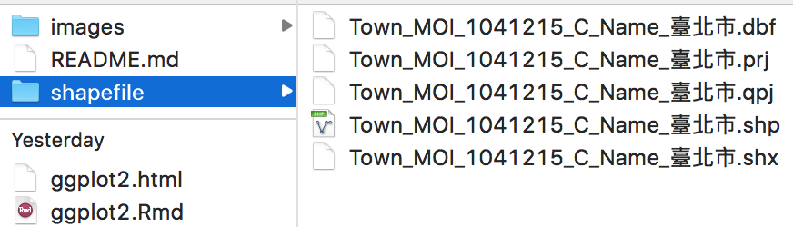

```{r setup 0, include=FALSE}
knitr::opts_chunk$set(echo = TRUE)
```

# Getting started

---

### 沒安裝的人今天應該進不來 😈😈😈

<iframe width="560" height="315" src="https://www.youtube.com/embed/fcd6zSk0yd8" frameborder="0" allowfullscreen></iframe>

---


## Summit Suen

- Full Stack Developer / Data Scientist.
- 新聞電商推薦系統、輿情監控、運動數據分析
- Taiwan R User Group 共同主持人｜[社群活動](https://www.meetup.com/Taiwan-R/)｜[聚會錄影](https://www.youtube.com/user/TWuseRGroup)
- 

## RStudio & R & ...

### R ecosystem 簡介


## RStudio 新手上路

### 中文編碼設定
### Tools > Global Options > Default text encoding


## RStudio 新手上路

### 初始環境
### Tools > Global Options


## RStudio 新手上路

### 工作目錄設定**（重要！）**
### `setwd('/path/where/your/data/located')`


## RStudio 新手上路

### `命令列`介面
### 注意命令列的狀態：`>` or `+`；愛惜生命，常用 `tab` 和 `?`



## RStudio 新手上路

### `程式碼` 編輯介面
### 養成在編輯界面撰寫的習慣


## RStudio 新手上路

### RStudio 的<del>快樂夥伴</del>快捷鍵們
[All RStudio keyboard shortcuts](https://support.rstudio.com/hc/en-us/articles/200711853-Keyboard-Shortcuts)

功能                    | Windows & Linux    | Mac
----------------------- | ------------------ | --------------------
顯示快捷鍵              | Alt+Shift+K        | Option+Shift+K
自動補完	              | Tab or Ctrl+Space  | Tab or Command+Space
執行（單行／選取範圍）  | Ctrl+Enter         | Command+Enter
註解（單行／選取範圍）  | Ctrl+Shift+C       | Command+Shift+C
存擋                    | Ctrl+S             | Command+S
縮排                    | Ctrl+I             | Command+I

## R 到底是什麼東西 R {.build}

### 先把 R 當成計算機
```{r calculator}
1 + 1
sin(2017)
pi
```

## R 到底是什麼東西 R {.build}

### 統計是看家本領
```{r statistics}
# Kolmogorov-Smirnov Tests
ks.test(iris$Sepal.Length, iris$Petal.Length)
```

## R 到底是什麼東西 R {.build}

### 統計是看家本領
```{r statistics density}
plot(density(iris$Sepal.Length), xlim = range(c(iris$Sepal.Length, iris$Petal.Length)), main = "Sample PDF")
lines(density(iris$Petal.Length), col = 2)
```

## R 到底是什麼東西 R {.build}

### A/B Testing（媒體、電子商務、流量成長駭客必備工具）
- 我們的 APP 推出了改版，要比較新舊 UI 功能的成效；於是 sample 了一群 user 試用新介面（功能）
  + 新介面（功能）：在  3000 點擊有 10 個購買
  + 舊介面（功能）：在 50000 點擊有 30 個購買
- 我怎麼知道這兩種方法的轉換率（購買／點擊）是不是明顯不同？

## R 到底是什麼東西 R {.build}

### A/B Testing（媒體、電子商務、流量成長駭客必備工具）{.build}
```{r more statistics}
# install.packages("binom")
library(binom)
# Binomial confidence intervals
binom.confint(c(10, 30), c(3000, 50000), methods = "exact")
```

# 資料前處理 `dplyr`

```{r child = 'rbasic.Rmd'}
```

# 資料視覺化 `ggplot2`

```{r child = 'ggplot2-slides/ggplot.Rmd'}
```

# 手把手時間

# 更多學習資源

## Learning Materials

- [Try R](http://tryr.codeschool.com/)
- [DataCamp](https://www.datacamp.com/getting-started?step=2&track=r)
- [RStudio Cheat Sheets](https://www.rstudio.com/resources/cheatsheets/)
- [.Rddj](https://rddj.info/)
- [538 w/ R](http://blog.revolutionanalytics.com/2016/07/data-journalism-with-r-at-538.html)
- [538 on github](https://github.com/fivethirtyeight/guns-data)

# BONUS 時間

## 畫地圖 {.build}

- 上次的知了小學堂 Miss Monday 教了大家 `QGIS`
- 你知道在 R 裡面也可以畫地圖嗎 😂😂😂
- 讀 `shapefile` 地圖檔（可以在 `QGIS` 先處理完）


```{r map 0, echo=TRUE, warning=FALSE, message=FALSE}
# install.packages(c("rgdal", "ggmap"))
# brew install gdal
library(rgdal)
library(ggplot2)
library(ggmap)
shapefile <- readOGR("shapefile", "Town_MOI_1041215_C_Name_臺北市")
```

## 畫地圖 {.build}

- 使用 `ggplot2::fortify()` 將讀進來的 `shapefile` 轉換成為 `DataFrame`
```{r map 1, echo=TRUE}
shapefile_df <- fortify(shapefile)
shapefile_df %>% head()
```

## 畫地圖 {.build}

- 使用 `ggplot2::geom_path()` 畫地圖
```{r map 2, echo=TRUE}
map <- ggplot() + 
  geom_path(data = shapefile_df, 
            aes(x = long, y = lat, group = group),
            color = 'gray', size = 1)
print(map)
```

## 畫地圖 {.build}

- 運用座標投影修正畫出來的地圖
```{r map 3, echo=TRUE}
map_projected <- map + coord_map()
print(map_projected)
```

# 大家掰掰，期待下次見面：）